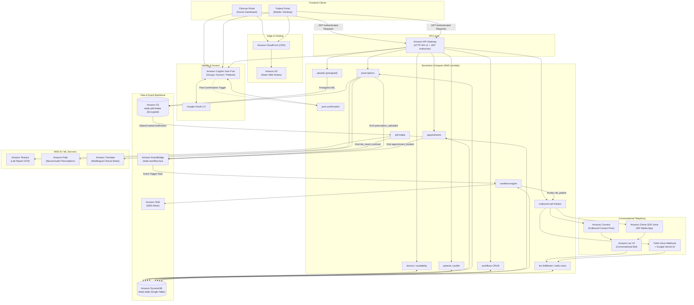

# Vitalis — Enterprise Serverless Healthcare Workflow Automation Platform

[](https://aws.amazon.com/)
[](https://aws.amazon.com/cdk/)
[](https://www.typescriptlang.org/)
[](https://nextjs.org/)
[](https://tailwindcss.com/)
[](https://aws.amazon.com/dynamodb/)
[](https://aws.amazon.com/serverless/)

Vitalis is an enterprise-grade, AWS-native healthcare workflow automation and telehealth orchestration platform engineered completely from scratch. It bridges the critical care gap between clinical consultations and post-treatment recovery by uniting serverless computing, event-driven orchestration, automated AI conversational voice agents, intelligent clinical document processing, and multilingual accessibility into a unified, HIPAA-ready architecture.

Vitalis runs on a **100% pay-per-use, serverless foundation**. It eliminates idle infrastructure expenses (no NAT Gateways, no provisioned RDS instances, no persistent EC2 clusters) while maintaining sub-second latency, ironclad data consistency, and enterprise security.

---

## Table of Contents

- [Key Capabilities](#key-capabilities)
- [Comprehensive AWS Services Architecture](#comprehensive-aws-services-architecture)
- [End-to-End System Architecture](#end-to-end-system-architecture)
- [Core Subsystems & Feature Deep Dives](#core-subsystems--feature-deep-dives)
  - [1. No-Code Clinical Workflow Engine](#1-no-code-clinical-workflow-engine)
  - [2. Intelligent Clinical Document Intake (Amazon Textract)](#2-intelligent-clinical-document-intake-amazon-textract)
  - [3. Automated Conversational Voice Follow-Ups](#3-automated-conversational-voice-follow-ups)
  - [4. Multilingual Accessible Prescriptions (Amazon Polly & Translate)](#4-multilingual-accessible-prescriptions-amazon-polly--translate)
  - [5. Conflict-Free Appointment Booking & Availability](#5-conflict-free-appointment-booking--availability)
  - [6. Identity, Security & Role-Based Access Control](#6-identity-security--role-based-access-control)
- [Database Architecture: DynamoDB Single-Table Design](#database-architecture-dynamodb-single-table-design)
- [API Reference](#api-reference)
- [Frontend Portal Architecture](#frontend-portal-architecture)
- [Repository Structure](#repository-structure)
- [Getting Started & Deployment Guide](#getting-started--deployment-guide)
  - [Prerequisites](#prerequisites)
  - [Backend Deployment (VitalisStack)](#backend-deployment-vitalisstack)
  - [Frontend Deployment (VitalisFrontendStack)](#frontend-deployment-vitalisfrontendstack)
  - [Optional Telephony Configurations](#optional-telephony-configurations)
- [Testing & Verification](#testing--verification)
- [Cost & Performance Profile](#cost--performance-profile)
- [License](#license)

---

## Key Capabilities

- **Engineered From Scratch**: Custom-architected data structures, microservices, and client interfaces designed specifically for clinical workflows, appointment lifecycles, and patient engagement.
- **Autonomous Post-Consultation Check-ins**: Outbound voice agents check on recovering patients after appointments, detect persistent or emergency symptoms, reschedule follow-up slots atomically, or escalate directly to clinicians.
- **Intelligent Lab Document OCR**: Automated extraction of medical laboratory panels (e.g., lipid profile, cholesterol, metabolic indicators) via computer vision and form analysis, triggering downstream workflows automatically.
- **Multilingual Prescription Accessibility**: Digital and PDF prescriptions with built-in neural text-to-speech (TTS) playback in multiple dialects and real-time translation for diverse patient demographics.
- **Visual No-Code Workflow Canvas**: Clinicians configure custom logic (Triggers $\rightarrow$ Conditions $\rightarrow$ Actions $\rightarrow$ Outputs) with a drag-and-drop node graph builder.
- **Zero-Collision Scheduling**: Transactional DynamoDB conditional expressions prevent double-booking across concurrent clinician appointment requests.
- **Zero Compute at Rest**: 100% serverless across frontend and backend; scales from zero to peak traffic on demand with near-zero idle expenses.

---

## Comprehensive AWS Services Architecture

Vitalis harnesses the breadth of the Amazon Web Services ecosystem, leveraging managed services for compute, data, security, AI/ML, and telephony:

| AWS Service | Category | Specific Role in Vitalis |
|---|---|---|
| **AWS Lambda** | Compute | 22+ specialized microservices running Node.js 20.x bundled via `esbuild`. Handles RESTful operations, event routing, atomic state mutations, and external webhooks. |
| **Amazon DynamoDB** | Database | Core single-table data layer (`vitalis-table`) operating in on-demand capacity mode (`PAY_PER_REQUEST`). Manages users, appointments, medical conditions, prescriptions, workflows, and call audit trails with GSI-based querying. |
| **Amazon S3** | Storage | Multi-bucket storage with private access controls (`BLOCK_ALL`), server-side encryption, and lifecycle policies. Houses clinical lab PDFs, signed prescription documents, generated audio assets, and static web assets. |
| **Amazon API Gateway (HTTP API v2)** | Networking | Low-latency, cost-effective API entry point with native Cognito JWT authorizers, granular route-level permissions, CORS management, and public webhook endpoints. |
| **Amazon EventBridge** | Orchestration | Decoupled event bus (`vitalis-workflow-bus`) orchestrating domain triggers (`lab_result_received`, `prescription_uploaded`, `appointment_booked`) to fire automated workflows. |
| **Amazon Cognito** | Security & Identity | Complete identity management featuring User Pools, custom attributes (`custom:role`), RBAC groups (`Doctors`, `Patients`), Hosted UI, Google OAuth 2.0 social federation, and Post-Confirmation Lambda hooks. |
| **Amazon Textract** | AI / Machine Learning | Multi-page OCR and document intelligence engine analyzing uploaded laboratory reports to extract structured key-value pairs and tabular test parameters without manual data entry. |
| **Amazon Polly** | AI / Voice Synthesis | High-fidelity neural text-to-speech engine generating natural human-voice audio renditions of written prescriptions and dosage directions across 5+ languages. |
| **Amazon Translate** | AI / Language | Neural machine translation transforming prescription directions, clinician instructions, and diagnoses into patients' preferred languages on the fly. |
| **Amazon Lex V2** | Conversational AI | Natural Language Understanding (NLU) conversational bot with custom medical follow-up intents (`PatientIsFine`, `ProblemPersists`, `ScheduleFollowUp`, `DeclineFollowUp`, `EmergencySymptoms`, `FallbackIntent`) wired to Lambda dialog/fulfillment hooks. |
| **Amazon Connect** | Contact Center / Telephony | Enterprise cloud contact center initiating automated outbound voice calls, linking dynamic contact flows directly with patient context and Lex V2 conversational agents. |
| **Amazon Chime SDK Voice** | Telephony / PSTN Audio | Alternate telephony pathway utilizing SIP Media Applications (SMA) to conduct outbound automated patient calls with Lex bot integration, compatible across all global account types. |
| **Amazon CloudFront** | CDN & Edge | Global content delivery network using Origin Access Control (OAC) to serve the statically exported Next.js frontend with SSL termination, edge caching, and SPA client routing. |
| **Amazon SNS** | Messaging / Notifications | Outbound SMS delivery service used by the workflow automation engine to alert patients regarding urgent lab findings and appointment reminders. |
| **AWS IAM** | Security & Governance | Granular, least-privilege IAM roles and policies ensuring strict cross-service isolation and secure service-to-service execution. |
| **Amazon CloudWatch** | Monitoring & Observability | Structured logging, 7-day retention log groups for all microservices, and execution metrics across workflows and telephony pipelines. |
| **AWS CDK v2** | Infrastructure as Code | 100% code-defined infrastructure in TypeScript across modular backend and frontend stacks (`VitalisStack`, `VitalisFrontendStack`). |

---

## End-to-End System Architecture



---

## Core Subsystems & Feature Deep Dives

### 1. No-Code Clinical Workflow Engine

The core automation brain of Vitalis is a custom, event-driven graph execution engine implemented in `lambda/workflow-engine/index.ts`:

- **Dynamic Graph Schema**: Clinical workflow definitions are stored as JSON graphs in DynamoDB (`PK=WORKFLOW#<id>`, `SK=DEFINITION`), allowing doctors to create, inspect, and update automated care pathways without redeploying code.
- **Event-Driven Execution**: Whenever domain events fire onto `vitalis-workflow-bus` (e.g., `lab_result_received`, `prescription_uploaded`, `appointment_booked`), EventBridge triggers the engine Lambda.
- **Node Evaluation Pipeline**:
  - **Triggers**: Match against event types and detail payloads.
  - **Conditions**: Deterministic logic nodes evaluating extracted lab thresholds (`value_greater_than`, e.g., Cholesterol > 240 mg/dL), patient age boundaries (`patient_age_gt`), or custom parameters.
  - **Actions**: Real-world operations including SMS dispatch via Amazon SNS (`send_sms`), automated outbound telephony (`call_patient`), slot booking (`schedule_appointment`), or electronic referrals.
  - **Outputs**: Audit markers recording run history in DynamoDB (`PK=WORKFLOW#<id>`, `SK=RUN#<runId>`).

### 2. Intelligent Clinical Document Intake (Amazon Textract)

Eliminates manual lab result transcription through automated document understanding:

1. **Secure Presigned Upload**: The patient or clinician initiates an upload via `POST /uploads/lab-pdf`. The backend generates an expiring S3 presigned PUT URL targeting `lab-pdfs/<patientId>/<uuid>-<filename>.pdf` with strict CORS and bucket encryption.
2. **Direct Browser Upload**: The frontend uploads the raw PDF directly to Amazon S3, avoiding memory-intensive file buffers in API Gateway or Lambda.
3. **Automated OCR Trigger**: The S3 `ObjectCreated:Put` event automatically triggers `lambda/pdf-intake/index.ts`.
4. **Computer Vision Document Extraction**: Amazon Textract's `AnalyzeDocumentCommand` (utilizing `FORMS` and `TABLES` feature types) parses key-value pairs (Patient Name, DOB, MRN, Test Parameters) and tabular clinical results.
5. **Persistence & Event Generation**: The extracted fields are persisted to DynamoDB (`LAB_RESULT#<id>`), and a `lab_result_received` event is emitted onto EventBridge to kick off automated clinical workflows.

### 3. Automated Conversational Voice Follow-Ups

Vitalis includes an autonomous post-treatment voice agent that proactively dials patients to evaluate recovery progress.

#### Conversational Script State Machine
The agent executes an intelligent clinical protocol designed with strict safety boundaries:

```
[A] Low-risk identity confirmation (Patient first name verification)
 │
 ▼
[B] "Are you feeling better, or does the problem still persist?"
 ├──► [C] PatientIsFine: Thank-you message, record positive outcome, end call safely.
 ├──► [D] ProblemPersists: Express empathy, offer follow-up appointment booking, notify doctor.
 │     ├──► [E] ScheduleFollowUp:
 │     │         - Query next open doctor slots atomically (lambda/get-next-slots)
 │     │         - Offer slot options to patient
 │     │         - Reserve and confirm chosen slot atomically (lambda/reserve-slot-and-schedule)
 │     └──► [F] DeclineFollowUp: Advise self-care / clinic contact, end call.
 ├──► [G] EmergencySymptoms:
 │         - Severe chest pain, shortness of breath, heavy bleeding detected
 │         - Immediately instruct patient to dial 911 / emergency services
 │         - Instantly notify treating physician with high priority
 │         - End call without diagnosing or offering standard scheduling
 └──► [H] FallbackIntent / Unclear Speech:
           - Repeat prompt once; if unresolved, log unreachable state and alert physician.
```

#### Flexible Multi-Provider Architecture
To support diverse AWS account types and deployment constraints, Vitalis supports three interchangeable telephony providers selected via CDK context:

1. **Amazon Connect + Amazon Lex V2**: Native enterprise contact center routing outbound calls with dynamic Lex V2 bot association and voice synthesis.
2. **Amazon Chime SDK Voice + Amazon Lex V2**: AISPL-compatible PSTN audio pipeline utilizing SIP Media Applications (SMA) provisioned via custom CloudFormation providers (`lambda/chime-sma-provisioner`).
3. **Twilio Voice + Google Gemini AI**: Cloud telephony integration with real-time Gemini NLU intent classification and dynamic TwiML response generation.

#### Patient Consent & Safety Gating
- E.164 phone number validation (`/^\+[1-9]\d{7,14}$/`) enforced server-side.
- Consent verification: Automated calls are strictly blocked unless `followUpCallsEnabled: true` AND valid `consentTimestamp` and `consentVersion` are recorded in the patient profile.
- Real-time mid-call opt-out check: Every conversational turn re-validates consent against DynamoDB. If a patient withdraws consent, the call terminates immediately.
- Comprehensive audit timeline: Every call status change (`requested`, `initiated`, `answered`, `verified`, `intent_detected`, `appointment_scheduled`, `emergency_triggered`, `ended`) is written to an immutable DynamoDB audit stream.

### 4. Multilingual Accessible Prescriptions (Amazon Polly & Translate)

Prescription comprehension is vital for patient safety. Vitalis supports both doctor-uploaded PDF prescriptions and structured digital prescriptions:

- **Doctor-Only Issuance**: Clinicians issue prescriptions via `POST /prescriptions` (structured diagnosis, notes, and medication arrays with dosage/frequency) or upload official scans via `POST /prescriptions/presign`.
- **Idempotent Workflow Triggering**: Once an appointment is marked `completed` and a prescription is attached, a conditional write to an event marker item (`EVENT_MARKER#prescription_uploaded`) guarantees that downstream follow-up workflows are scheduled exactly once.
- **Multilingual Neural Translation**: `POST /prescriptions/{id}/translate` uses Amazon Translate to translate clinical advice into Spanish, French, German, Hindi, and more.
- **Neural Text-to-Speech Synthesis**: `POST /prescriptions/{id}/audio` invokes Amazon Polly (`SynthesizeSpeechCommand`) using specialized neural voices (e.g., Joanna, Conchita, Celine, Marlene, Aditi). The synthesized MP3 is stored in S3 and served via an expiring presigned GET URL, allowing vision-impaired or elderly patients to listen to their medication instructions clearly.

### 5. Conflict-Free Appointment Booking & Availability

- **Doctor Availability Manager**: Clinicians declare availability slots stored as `DOCTOR#<id>` / `SLOT#<isoTimestamp>` items with status `open`.
- **Atomic Two-Phase Slot Reservation**: When a patient or voice agent books an appointment, `lambda/appointments/index.ts` and `lambda/reserve-slot-and-schedule/index.ts` perform a conditional update on the slot:
  ```typescript
  ConditionExpression: "attribute_exists(PK) AND #status = :open"
  ```
  If another user books the slot concurrently, DynamoDB throws `ConditionalCheckFailedException`, returning an immediate conflict error and preventing any double-booking.
- **Booking Lifecycle**: Transitions through `booked` $\rightarrow$ `completed` $\rightarrow$ `cancelled` with full reverse indexing for doctor and patient schedule views.

### 6. Identity, Security & Role-Based Access Control

- **Granular Cognito User Groups**: Users belong to either `Doctors` or `Patients` groups.
- **Post-Confirmation Hook**: A Cognito Post-Confirmation Lambda trigger (`lambda/post-confirmation`) inspects the self-selected `custom:role` attribute upon email confirmation and places the user into their respective group via `AdminAddUserToGroup`.
- **Claims Verification**: API Gateway HTTP API validates the Cognito JWT on every incoming request. Lambdas unpack claims (`sub`, `cognito:groups`, `email`) and enforce resource-level authorization (e.g., ensuring only the treating physician can complete an appointment or issue prescriptions).
- **Google OAuth 2.0 Federation**: Configured with Cognito Hosted UI for single-sign-on (SSO).

---

## Database Architecture: DynamoDB Single-Table Design

Vitalis utilizes a high-performance single-table design (`vitalis-table`) with a single Global Secondary Index (`GSI1`), optimizing read/write throughput and cost efficiency.

### Key Indexing Schema

- **Primary Table**:
  - Partition Key: `PK` (String)
  - Sort Key: `SK` (String)
- **Global Secondary Index 1 (GSI1)**:
  - Partition Key: `GSI1PK` (String)
  - Sort Key: `GSI1SK` (String)

### Entity Mapping Reference

| Entity | PK | SK | GSI1PK | GSI1SK | Description |
|---|---|---|---|---|---|
| **Doctor Profile** | `DOCTOR#<id>` | `PROFILE` | — | — | Clinician details, specialty, biography |
| **Doctor Slot** | `DOCTOR#<id>` | `SLOT#<isoTimestamp>` | `DOCTOR_SLOTS#<doctorId>` | `<isoTimestamp>` | Available, held, or booked consultation slots |
| **Patient Profile** | `PATIENT#<id>` | `PROFILE` | — | — | Contact, phone, follow-up consent settings |
| **Patient Condition** | `PATIENT#<id>` | `CONDITION#<id>` | — | — | Chronic diagnoses with ICD-10 codification |
| **Patient Medication**| `PATIENT#<id>` | `MEDICATION#<id>` | — | — | Active prescriptions, dosages, schedules |
| **Appointment** | `APPT#<id>` | `DETAILS` | `PATIENT_APPTS#<patientId>` or `DOCTOR_APPTS#<doctorId>` | `<isoTimestamp>` | Booked consultation details and status |
| **Idempotency Marker**| `APPT#<id>` | `EVENT_MARKER#prescription_uploaded` | — | — | Prevents duplicate event triggers |
| **Lab Result** | `LAB_RESULT#<id>` | `DETAILS` | — | — | Textract extracted parameters and source S3 key |
| **Prescription** | `PRESCRIPTION#<id>` | `DETAILS` | `APPT_PRESCRIPTION#<appointmentId>` | — | Digital or PDF prescription metadata |
| **Prescription Index**| `PRESCRIPTION#<id>` | `PATIENT_INDEX` | `PATIENT_PRESCRIPTIONS#<patientId>` | `<isoTimestamp>#<id>` | Patient prescription history query |
| **Prescription Index**| `PRESCRIPTION#<id>` | `DOCTOR_INDEX` | `DOCTOR_PRESCRIPTIONS#<doctorId>` | `<isoTimestamp>#<id>` | Doctor prescription history query |
| **Follow-Up Call** | `FOLLOWUP_CALL#<id>`| `DETAILS` | `APPT_FOLLOWUP#<appointmentId>` | `DETAILS` | Active call state, attempts, provider |
| **Call Audit Event** | `FOLLOWUP_CALL#<id>`| `EVENT#<isoTimestamp>#<name>` | — | — | Immutable chronological call event log |
| **Call Doctor Index**| `FOLLOWUP_CALL#<id>`| `DOCTOR_INDEX` | `DOCTOR_FOLLOWUPS#<doctorId>` | `<isoTimestamp>` | Doctor follow-up call history query |
| **In-App Notification**| `NOTIFICATION#<id>` | `DETAILS` | `DOCTOR_NOTIFICATIONS#<doctorId>` | `<isoTimestamp>` | Urgent alerts and clinical escalation notes |
| **Workflow Definition**| `WORKFLOW#<id>` | `DEFINITION` | — | — | JSON node graph for clinical automation |
| **Workflow Run** | `WORKFLOW#<id>` | `RUN#<runId>` | — | — | Execution history and condition outcomes |

---

## API Reference

All protected routes require an `Authorization: Bearer <Cognito_ID_Token>` header.

### Authentication & Profiles
- `GET /doctors` — Public directory of registered clinicians.
- `GET /doctors/{id}` — Fetch doctor profile and specialties.
- `PUT /doctors/{id}` — Update doctor profile (Clinician only).
- `GET /patients/{id}` — Fetch patient medical profile.
- `PUT /patients/{id}` — Update patient profile, contact info, and phone follow-up consent.
- `GET /patients/{id}/conditions` / `POST /patients/{id}/conditions` — Manage ICD-10 medical conditions.
- `GET /patients/{id}/medications` / `POST /patients/{id}/medications` — Manage active medications.

### Availability & Appointments
- `GET /doctors/{id}/availability` — List open availability slots for a clinician.
- `POST /doctors/{id}/availability` — Create new availability slots (Clinician only).
- `DELETE /doctors/{id}/availability/{slotId}` — Remove an availability slot.
- `POST /appointments` — Atomically book an open slot.
- `GET /appointments/{id}` — Retrieve appointment status and details.
- `PUT /appointments/{id}` — Mark appointment status (`completed`, `cancelled`).
- `GET /patients/{id}/appointments` — List all appointments for a patient.
- `GET /doctors/{id}/appointments` — List all appointments for a clinician.

### Clinical Documents & Prescriptions
- `POST /uploads/lab-pdf` — Obtain an expiring presigned S3 URL for lab report PDF upload.
- `POST /prescriptions/presign` — Obtain presigned S3 upload URL for doctor prescription PDF.
- `POST /prescriptions/confirm` — Confirm PDF upload and emit downstream trigger.
- `POST /prescriptions` — Issue structured digital prescription (diagnosis, medications, notes).
- `GET /prescriptions?appointmentId=...` — Retrieve prescriptions for an appointment.
- `GET /prescriptions/{id}` — Retrieve single prescription details.
- `GET /prescriptions/{id}/download` — Presigned S3 GET URL to download prescription PDF.
- `POST /prescriptions/{id}/audio` — Synthesize neural prescription audio via Amazon Polly.
- `POST /prescriptions/{id}/translate` — Translate clinical instructions via Amazon Translate.
- `GET /patients/{id}/prescriptions` — View patient prescription history.
- `GET /doctors/{id}/prescriptions` — View clinician issued prescriptions.

### Telephony & Automated Follow-Ups
- `POST /appointments/{id}/follow-up-call` — Manually trigger an outbound follow-up check-in call.
- `GET /follow-up-calls?appointmentId=...` — Retrieve call status, outcome, and audit timeline.
- `GET /doctors/{id}/notifications` — Doctor notifications for persistent/emergency symptoms.
- `POST /follow-up-calls/twilio/answer` — *(Twilio webhook)* Speech answer prompt.
- `POST /follow-up-calls/twilio/input` — *(Twilio webhook)* Speech input analysis & Gemini classification.
- `POST /follow-up-calls/twilio/status` — *(Twilio webhook)* Call status update handler.

### Workflow Automation
- `GET /workflows` — List all clinical workflow definitions.
- `POST /workflows` — Create a new clinical automation workflow graph.
- `GET /workflows/{id}` — Retrieve workflow graph definition.
- `PUT /workflows/{id}` — Update workflow graph structure.
- `DELETE /workflows/{id}` — Delete a workflow.
- `GET /workflows/{id}/runs` — Inspect workflow execution audit logs.

---

## Frontend Portal Architecture

The frontend is a dedicated Next.js 14 application (`frontend/`) built with the App Router, statically exported (`output: "export"`), and hosted on Amazon S3 + Amazon CloudFront:

```
frontend/
├── app/
│   ├── (public)/                 # Public unauthenticated routes
│   │   ├── page.tsx              # Modern landing page with interactive features
│   │   ├── login/page.tsx        # Cognito authentication interface
│   │   ├── signup/page.tsx       # Registration with role selector (Doctor/Patient)
│   │   ├── forgot-password/      # Password reset flow
│   │   ├── privacy/page.tsx      # Privacy Policy & HIPAA-aligned notice
│   │   └── terms/page.tsx        # Terms of Service
│   ├── (app)/                    # Authenticated portal shell
│   │   ├── layout.tsx            # Global navigation, auth guard, role redirection
│   │   ├── dashboard/page.tsx    # Intelligent role router
│   │   ├── doctor/               # Clinician Workspace
│   │   │   ├── appointments/     # Appointment list, complete & follow-up triggers
│   │   │   ├── availability/     # Interactive schedule builder & slot manager
│   │   │   ├── follow-up-calls/  # Real-time call tracker & audit event timeline
│   │   │   ├── workflows/        # No-code automation list & run audits
│   │   │   ├── workflows/builder # Drag-and-drop workflow canvas (React Flow)
│   │   │   └── profile/page.tsx  # Clinician professional credentials
│   │   └── patient/              # Patient Portal
│   │       ├── appointments/     # Upcoming/past consultations
│   │       ├── doctors/          # Specialist directory & real-time booking
│   │       ├── prescriptions/    # Multilingual reader, Polly audio player & PDF
│   │       └── profile/page.tsx  # Health profile, ICD-10, meds, call consent & S3 lab intake
├── components/                   # Reusable UI component design system (Radix + Tailwind)
└── lib/                          # Cognito auth client, API adapters, and helpers
```

---

## Repository Structure

```
Vitalis/
├── bin/
│   └── vitalis.ts               # CDK App entry point (VitalisStack & VitalisFrontendStack)
├── lib/
│   ├── vitalis-stack.ts         # Backend CDK Stack (Cognito, DDB, S3, API GW, Lex, Lambdas)
│   └── frontend-stack.ts        # Frontend CDK Stack (CloudFront, S3 Bucket Deployment)
├── lambda/
│   ├── _shared/                 # Shared DynamoDB client, claims, and call audit utilities
│   ├── appointments/            # Appointment booking, cancellation, completion
│   ├── availability/            # Doctor schedule slot management
│   ├── chime-sma-handler/       # Chime SDK Voice SMA call control & Lex bridge
│   ├── chime-sma-provisioner/   # Custom CloudFormation resource for Chime SMA
│   ├── doctors/                 # Doctor profiles and public directory
│   ├── fetch-patient-context/   # Patient context resolver for telephony contact flows
│   ├── follow-up-calls/         # Call status and audit timeline retrieval
│   ├── get-next-slots/          # Doctor available slots fetcher for voice bot
│   ├── lex-fulfillment/         # Lex V2 conversational branching script & actions
│   ├── notifications/           # Amazon SNS SMS dispatcher and in-app alerts
│   ├── notify-doctor/           # Clinician notification writer for call escalations
│   ├── outbound-call-initiator/ # Call validation, idempotency, and dialer
│   ├── patients/                # Patient profile, conditions, medications, call consent
│   ├── pdf-intake/              # S3-triggered Amazon Textract OCR document analyzer
│   ├── post-confirmation/      # Cognito trigger auto-assigning user groups
│   ├── prescriptions/           # Prescriptions, Polly audio & Translate integration
│   ├── reserve-slot-and-schedule/ # Atomic slot reservation for voice bot
│   ├── twilio-voice/            # Twilio webhook handler + Gemini AI conversational engine
│   ├── uploads/                 # Presigned S3 upload URL generator
│   ├── workflow-engine/         # EventBridge-driven no-code workflow graph executor
│   └── workflows/               # Workflow definition CRUD endpoints
├── frontend/                    # Next.js 14 App Router statically-exported web app
├── state-machine/               # Sample clinical workflow graph definitions
├── test/                        # Comprehensive unit and integration test suites
├── cdk.json                     # AWS CDK configuration
├── package.json                 # Backend dependencies and build scripts
└── tsconfig.json                # TypeScript compiler configuration
```

---

## Getting Started & Deployment Guide

### Prerequisites

- **Node.js**: v20.x or later
- **AWS CLI**: Installed and configured (`aws configure`) with administrative credentials
- **AWS CDK CLI**: Installed globally (`npm install -g aws-cdk`)

### Backend Deployment (VitalisStack)

1. **Clone the repository and install dependencies**:
   ```bash
   git clone https://github.com/your-username/vitalis.git
   cd vitalis
   npm install
   ```

2. **Bootstrap your AWS environment** (one-time per account/region):
   ```bash
   npx cdk bootstrap
   ```

3. **Deploy the backend stack**:
   ```bash
   npx cdk deploy VitalisStack
   ```

   *Upon successful deployment, CDK outputs critical endpoints and identifiers:*
   - `ApiUrl`: Your Amazon API Gateway base URL
   - `UserPoolId`: Cognito User Pool ID
   - `UserPoolClientId`: Cognito User Pool Client ID
   - `CognitoDomain`: Cognito Hosted UI domain
   - `TableName`: DynamoDB table name (`vitalis-table`)
   - `PdfBucketName`: S3 lab/prescription intake bucket
   - `WorkflowBusName`: EventBridge event bus name (`vitalis-workflow-bus`)

### Frontend Deployment (VitalisFrontendStack)

1. **Configure frontend environment**:
   Create `frontend/.env.production` using the outputs from `VitalisStack`:
   ```env
   NEXT_PUBLIC_API_URL=https://<api-id>.execute-api.<region>.amazonaws.com
   NEXT_PUBLIC_USER_POOL_ID=<region>_xxxxxxxxx
   NEXT_PUBLIC_USER_POOL_CLIENT_ID=xxxxxxxxxxxxxxxxxxxxxxxxxx
   NEXT_PUBLIC_COGNITO_DOMAIN=vitalis-<account>-<region>.auth.<region>.amazoncognito.com
   NEXT_PUBLIC_OAUTH_REDIRECT_URI=https://<your-domain>/login
   ```

2. **Build the static Next.js bundle**:
   ```bash
   cd frontend
   npm install
   npm run build
   cd ..
   ```
   *This compiles and exports the application to `frontend/out/`.*

3. **Deploy the frontend stack**:
   ```bash
   npx cdk deploy VitalisFrontendStack
   ```
   *Outputs `SiteUrl`: Your live Amazon CloudFront HTTPS distribution URL.*

   > **Note on New Accounts**: If your AWS account has a CloudFront verification hold, deploy using the S3 website fallback:
   > ```bash
   > npx cdk deploy VitalisFrontendStack -c enableS3WebsiteFallback=true
   > ```

### Optional Telephony Configurations

Vitalis allows you to pick the voice telephony provider suited for your environment:

#### Option A: Amazon Connect + Amazon Lex V2
```bash
npx cdk deploy VitalisStack \
  -c enableConnectLex=true \
  -c connectSourcePhoneNumber=+1XXXXXXXXXX
```

#### Option B: Amazon Chime SDK Voice (AISPL Compatible)
```bash
npx cdk deploy VitalisStack \
  -c enableChimeVoice=true \
  -c chimeSourcePhoneNumber=+1XXXXXXXXXX
```

#### Option C: Twilio Voice + Google Gemini AI
```bash
npx cdk deploy VitalisStack \
  -c enableTwilioVoice=true \
  -c twilioAccountSid=ACxxxxxxxxxxxxxxxxxxxxxxxxxxxxxxxx \
  -c twilioAuthToken=xxxxxxxxxxxxxxxxxxxxxxxxxxxxxxxx \
  -c twilioPhoneNumber=+1XXXXXXXXXX \
  -c geminiApiKey=AIzaxxxxxxxxxxxxxxxxxxxxxxxxxxxxxxx
```

---

## Testing & Verification

Vitalis includes comprehensive unit and integration test suites in `test/`:

- `appointment-slot-race.test.ts`: Verifies atomic conditional slot reservation under concurrent booking attempts.
- `call-outcome-mapping.test.ts`: Validates Amazon Lex conversational intent mapping, script branching, and doctor escalation.
- `consent-gating.test.ts`: Asserts that automated calls are blocked if phone consent is absent or withdrawn.
- `phone-validation.test.ts`: Verifies strict E.164 international phone number format enforcement.
- `prescription-event-idempotency.test.ts`: Tests DynamoDB event markers to guarantee that prescription follow-up events fire exactly once.
- `twilio-call-outcome-mapping.test.ts`: Tests Twilio TwiML generation and Gemini classification handlers.

Run all tests via:
```bash
npx jest
```

### Verifying the Workflow Engine with Sample Data

Load the included sample workflow into DynamoDB:
```bash
aws dynamodb put-item \
  --table-name vitalis-table \
  --item file://state-machine/sample-lab-followup-workflow.json
```
When a lab report PDF with a cholesterol value exceeding 240 is uploaded to S3, Amazon Textract parses the data and EventBridge triggers the workflow engine to dispatch an alert SMS and schedule a review.

---

## Cost & Performance Profile

Vitalis was intentionally engineered to run within strict budgetary guardrails:

- **DynamoDB**: `PAY_PER_REQUEST` ensures $0 billing when inactive.
- **AWS Lambda**: Sub-millisecond compute billing with generous monthly free-tier allowances.
- **API Gateway (HTTP API v2)**: 70% cheaper than traditional REST APIs with lower latency.
- **Amazon S3 & CloudFront**: Fraction-of-a-cent storage and edge bandwidth.
- **Amazon Cognito**: Free for up to 50,000 monthly active users (MAUs).
- **Zero Idle Provisioning**: No provisioned VPC endpoints, NAT Gateways, or always-on database instances. Sitting on this stack between clinical shifts or testing sessions incurs virtually **$0.00/month**.

---

## License

This project is licensed under the MIT License — see the [LICENSE](LICENSE) file for details.
